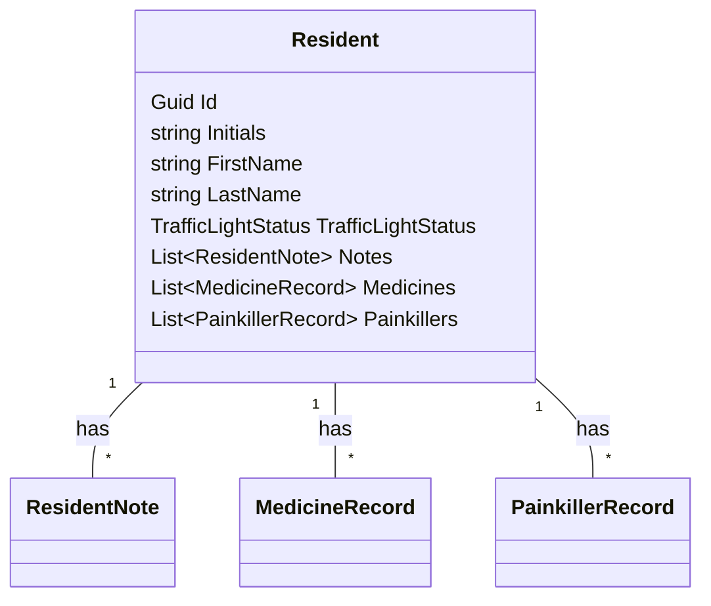

# Domain Model: Resident (UC-014)
## Metadata
| Key            | Value                                   |
|----------------|-----------------------------------------|
| Id             | DM-UC-014                               |
| crossReference | UC-014, BC, Gateway 11                  |
| Title          | Resident Entity for Citizen Management   |
| Author         | Team 6                                  |

## Version Log
| Version | Date       | Description         | Author |
|---------|------------|---------------------|--------|
| 0001    | 2026-05-03 | Initial DM for UC-014 | Team 6 |

## Domain Model Description
The Resident entity represents a citizen in the system. It is used for citizen administration, assignment, and management. The entity includes personal identification, status, and related records.

### Attributes
- **Id**: Unique identifier (GUID)
- **Initials**: Short initials for the citizen (max 2 characters)
- **FirstName**: Citizen's first name (max 50 characters) _(GDPR: Personal Data)_
- **LastName**: Citizen's last name (max 50 characters) _(GDPR: Personal Data)_
- **TrafficLightStatus**: Current status (e.g., green/yellow/red)
- **Notes**: Collection of notes related to the citizen
- **Medicines**: Collection of medicine records
- **Painkillers**: Collection of painkiller records

### Relationships
- **ResidentNote**: One-to-many (a resident can have multiple notes)
- **MedicineRecord**: One-to-many (a resident can have multiple medicine records)
- **PainkillerRecord**: One-to-many (a resident can have multiple painkiller records)

### Diagram

### Use Case Traceability
- **UC-014**: Create Citizen (Administration)
- **Gateway 11**: Citizen Administration Management

---
