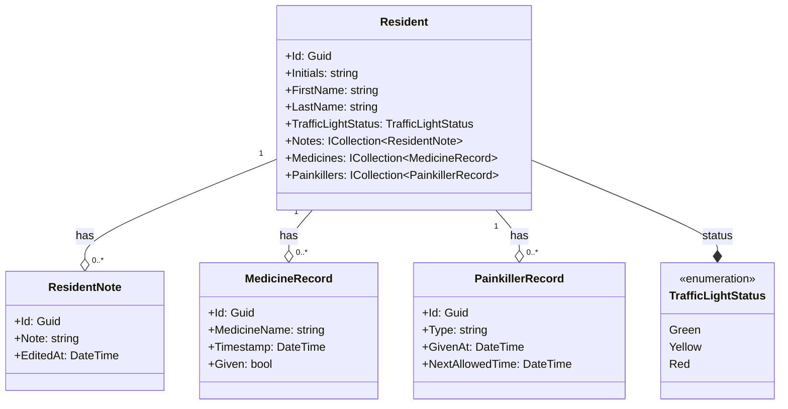
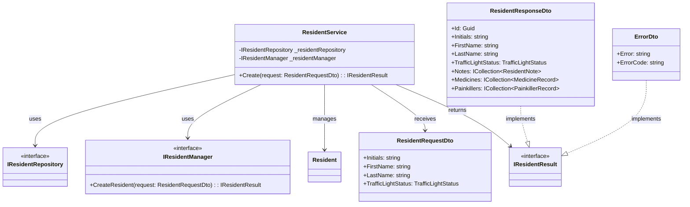
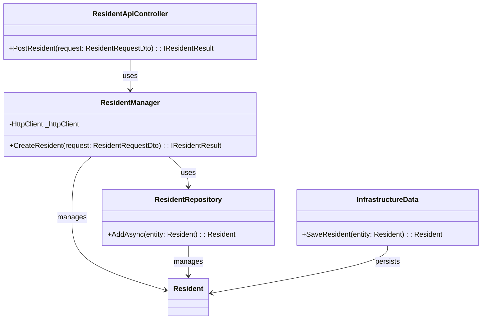
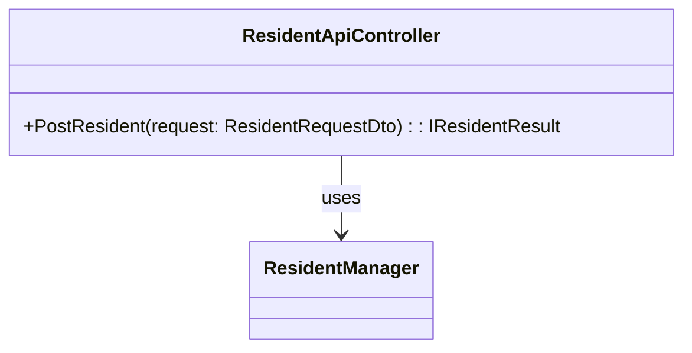
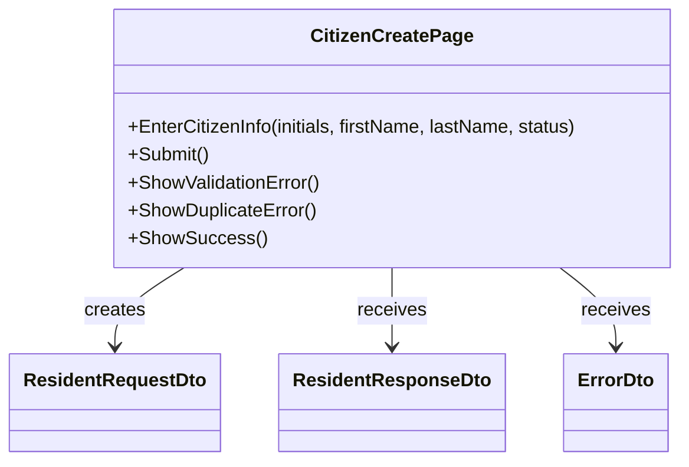

# Domain Class Diagram (DCD) for UC-014: Administration - Create Citizen

## Metadata
| Key            | Value                         |
|----------------|-------------------------------|
| Id             | DCD-UC-014                    |
| crossReference | DM-UC-014, UC-014             |

## Version Log
| Version | Date       | Description                        | Author     |
|---------|------------|------------------------------------|------------|
| 0001    | 2026-05-03 | Initial for UC-014                 | Team 6     |

---

## DCD for UC-014 Domain Layer

---

## DCD for UC-014 Application/Core Layer

---

## DCD for UC-014 Infrastructure Layer

---

## DCD for UC-014 WebApi Layer

---

## DCD for UC-014 WebUI Layer

