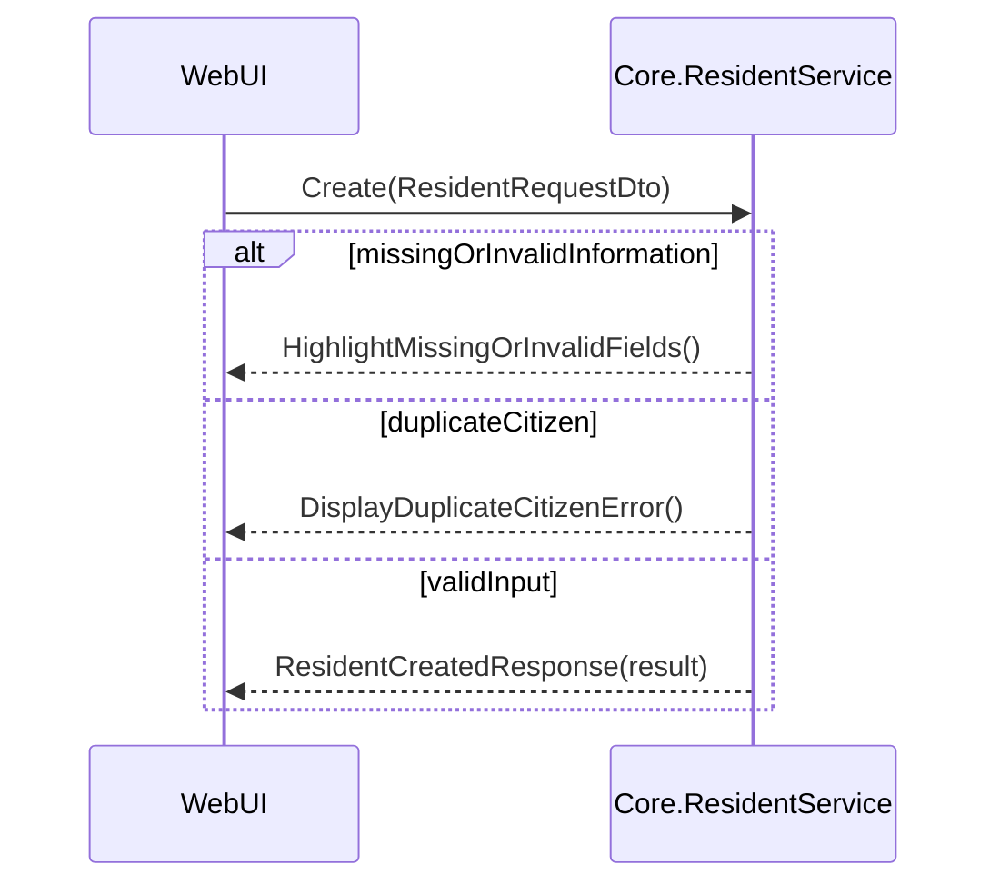
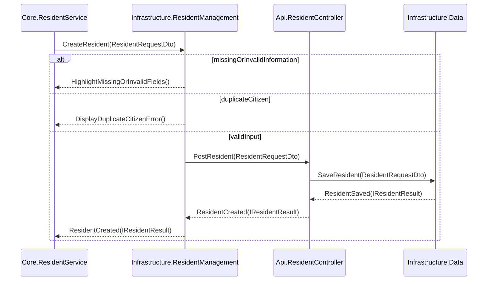

## Metadata
| Key            | Value                                   |
|----------------|-----------------------------------------|
| Id             | UC-014.SD                              |
| crossReference | UC-014.SSD, DM-UC-014                  |

## Version Log
| Version | Date       | Description      | Author |
|---------|------------|------------------|--------|
| 0001    | 2026-05-03 | Initial SD       | Team 6 |

## Sequence Diagram

### Presentation Layer → Application Layer

### Application Layer → Infrastructure Layer (Data Access)

**Notes:**
- All DTO transformations are handled at the boundaries between layers.
- No internal system calls or database details are shown beyond the Infrastructure.Data manager.
- Method names use PascalCase and parameters are shown in parentheses.
