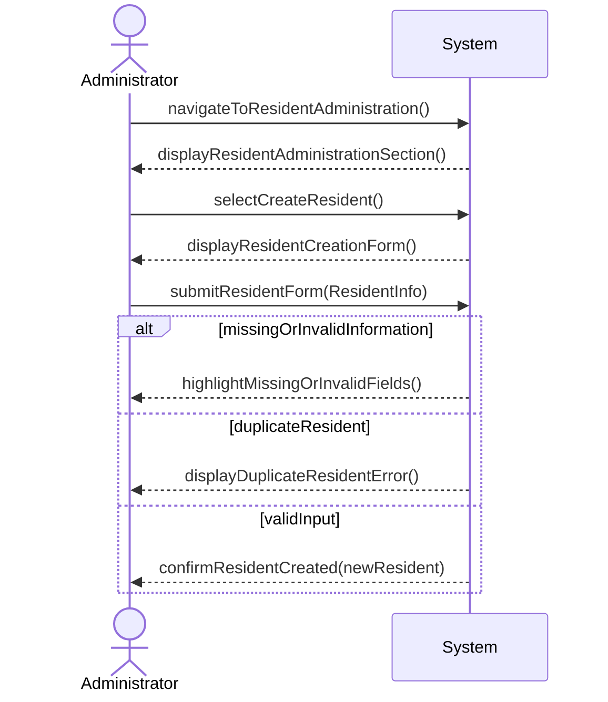

## Metadata
| Key            | Value                                   |
|----------------|-----------------------------------------|
| Id             | UC-014.SSD                              |
| crossReference | UC-014 DM-UC-014                        |

## Version Log
| Version | Date       | Description      | Author |
|---------|------------|------------------|--------|
| 0001    | 2026-05-03 | Initial SSD      | Team 6 |

## System Sequence Diagram

