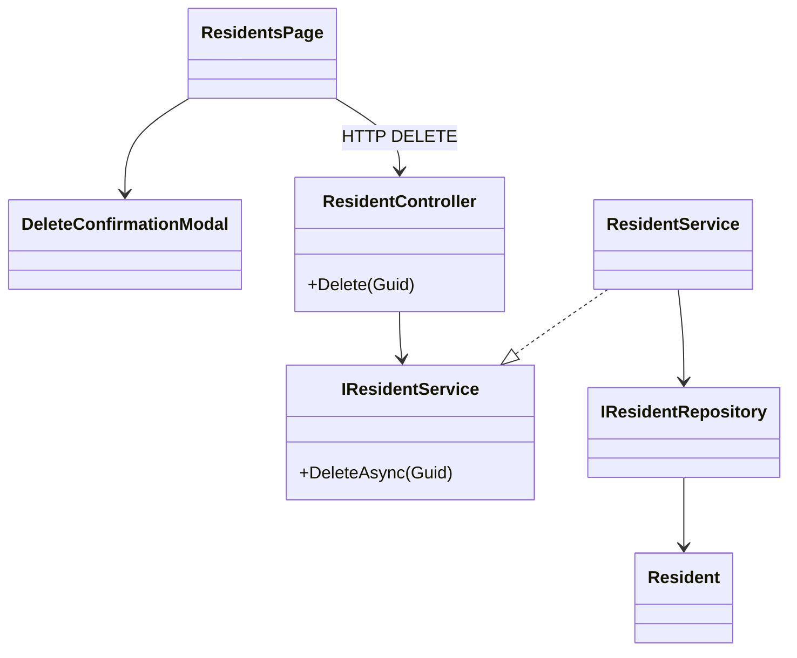

# UC-016 — Design Class Diagram

```mermaid
classDiagram
    class ResidentsPage
    class DeleteConfirmationModal
    class ResidentController { +Delete(Guid) }
    class IResidentService { +DeleteAsync(Guid) }
    class ResidentService
    class IResidentRepository
    class Resident

    ResidentsPage --> DeleteConfirmationModal
    ResidentsPage --> ResidentController : HTTP DELETE
    ResidentController --> IResidentService
    ResidentService ..|> IResidentService
    ResidentService --> IResidentRepository
    IResidentRepository --> Resident
```
