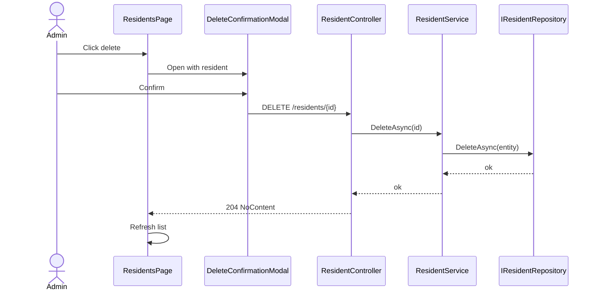

# UC-016 — Sequence Diagram

```mermaid
sequenceDiagram
    actor A as Admin
    participant UI as ResidentsPage
    participant Modal as DeleteConfirmationModal
    participant Api as ResidentController
    participant Svc as ResidentService
    participant Repo as IResidentRepository

    A->>UI: Click delete
    UI->>Modal: Open with resident
    A->>Modal: Confirm
    Modal->>Api: DELETE /residents/{id}
    Api->>Svc: DeleteAsync(id)
    Svc->>Repo: DeleteAsync(entity)
    Repo-->>Svc: ok
    Svc-->>Api: ok
    Api-->>UI: 204 NoContent
    UI->>UI: Refresh list
```
