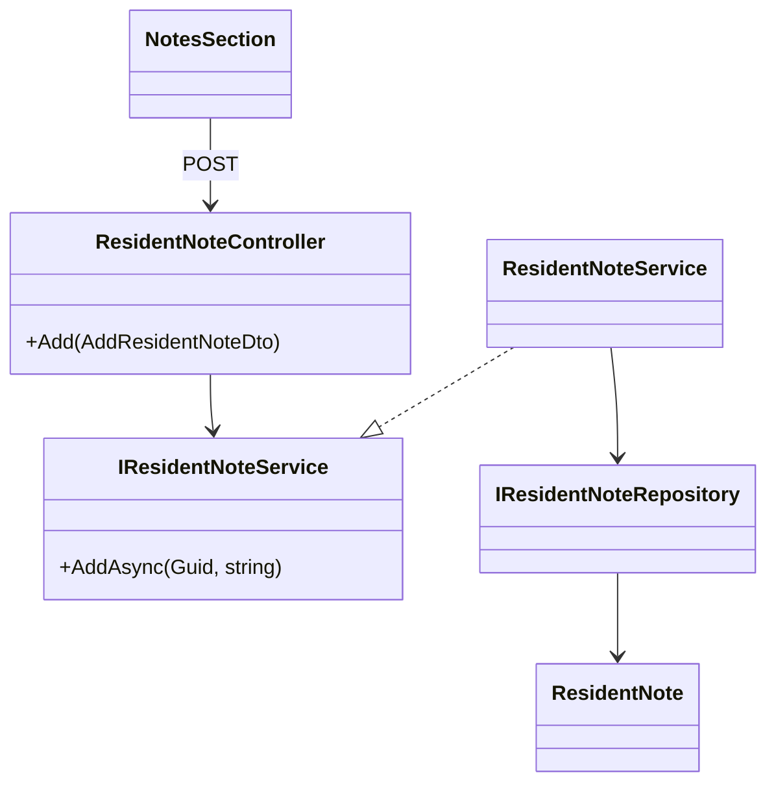

# UC-017 — Design Class Diagram

```mermaid
classDiagram
    class NotesSection
    class ResidentNoteController { +Add(AddResidentNoteDto) }
    class IResidentNoteService { +AddAsync(Guid, string) }
    class ResidentNoteService
    class IResidentNoteRepository
    class ResidentNote

    NotesSection --> ResidentNoteController : POST
    ResidentNoteController --> IResidentNoteService
    ResidentNoteService ..|> IResidentNoteService
    ResidentNoteService --> IResidentNoteRepository
    IResidentNoteRepository --> ResidentNote
```
