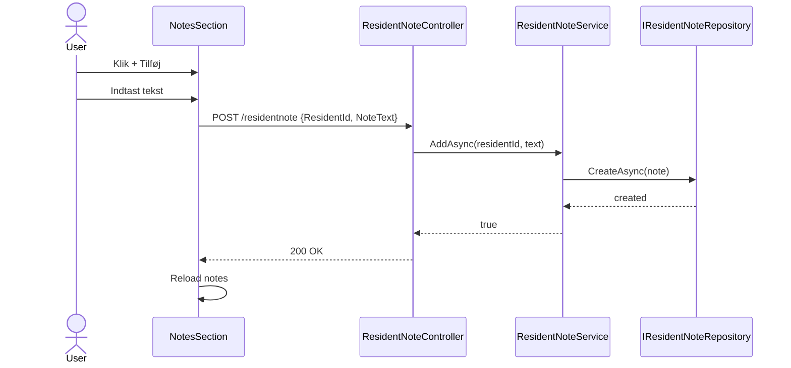

# UC-017 — Sequence Diagram

```mermaid
sequenceDiagram
    actor U as User
    participant UI as NotesSection
    participant Api as ResidentNoteController
    participant Svc as ResidentNoteService
    participant Repo as IResidentNoteRepository

    U->>UI: Klik + Tilføj
    U->>UI: Indtast tekst
    UI->>Api: POST /residentnote {ResidentId, NoteText}
    Api->>Svc: AddAsync(residentId, text)
    Svc->>Repo: CreateAsync(note)
    Repo-->>Svc: created
    Svc-->>Api: true
    Api-->>UI: 200 OK
    UI->>UI: Reload notes
```
