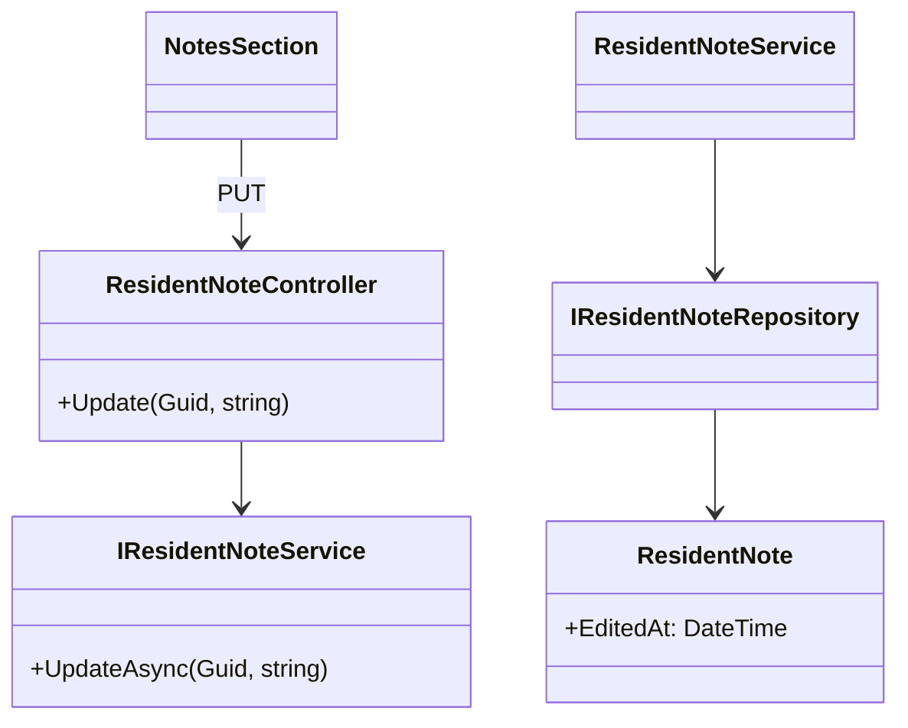

# UC-018 — Design Class Diagram

```mermaid
classDiagram
    class NotesSection
    class ResidentNoteController { +Update(Guid, string) }
    class IResidentNoteService { +UpdateAsync(Guid, string) }
    class ResidentNoteService
    class IResidentNoteRepository
    class ResidentNote { +EditedAt: DateTime }

    NotesSection --> ResidentNoteController : PUT
    ResidentNoteController --> IResidentNoteService
    ResidentNoteService --> IResidentNoteRepository
    IResidentNoteRepository --> ResidentNote
```
