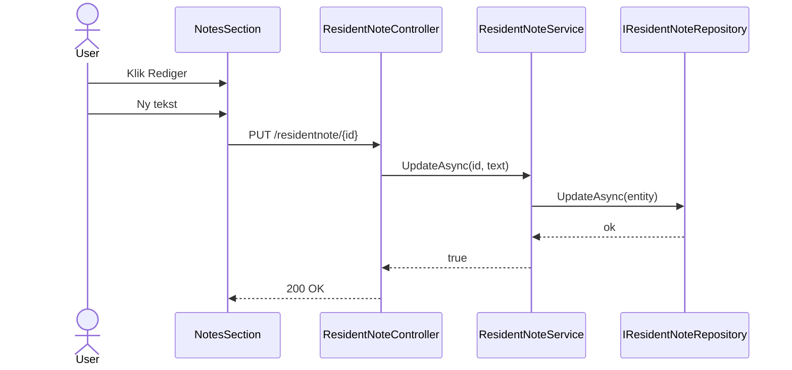

# UC-018 — Sequence Diagram

```mermaid
sequenceDiagram
    actor U as User
    participant UI as NotesSection
    participant Api as ResidentNoteController
    participant Svc as ResidentNoteService
    participant Repo as IResidentNoteRepository

    U->>UI: Klik Rediger
    U->>UI: Ny tekst
    UI->>Api: PUT /residentnote/{id}
    Api->>Svc: UpdateAsync(id, text)
    Svc->>Repo: UpdateAsync(entity)
    Repo-->>Svc: ok
    Svc-->>Api: true
    Api-->>UI: 200 OK
```
