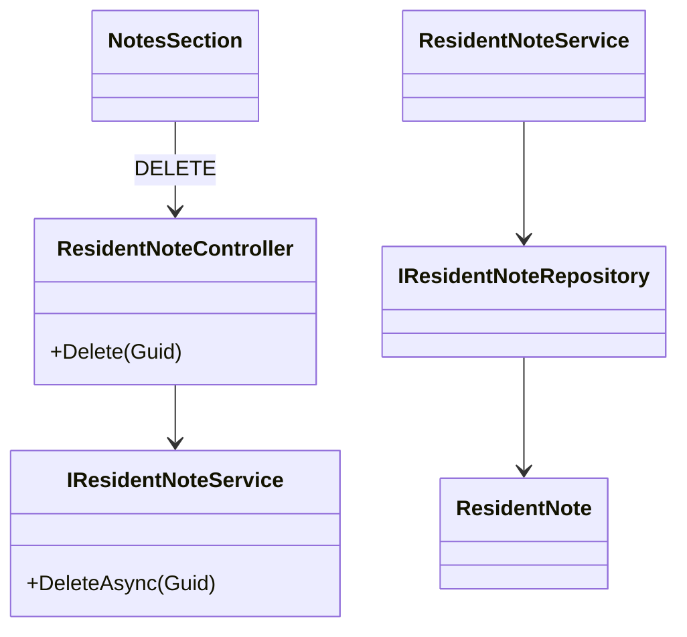

# UC-019 — Design Class Diagram

```mermaid
classDiagram
    class NotesSection
    class ResidentNoteController { +Delete(Guid) }
    class IResidentNoteService { +DeleteAsync(Guid) }
    class ResidentNoteService
    class IResidentNoteRepository
    class ResidentNote

    NotesSection --> ResidentNoteController : DELETE
    ResidentNoteController --> IResidentNoteService
    ResidentNoteService --> IResidentNoteRepository
    IResidentNoteRepository --> ResidentNote
```
