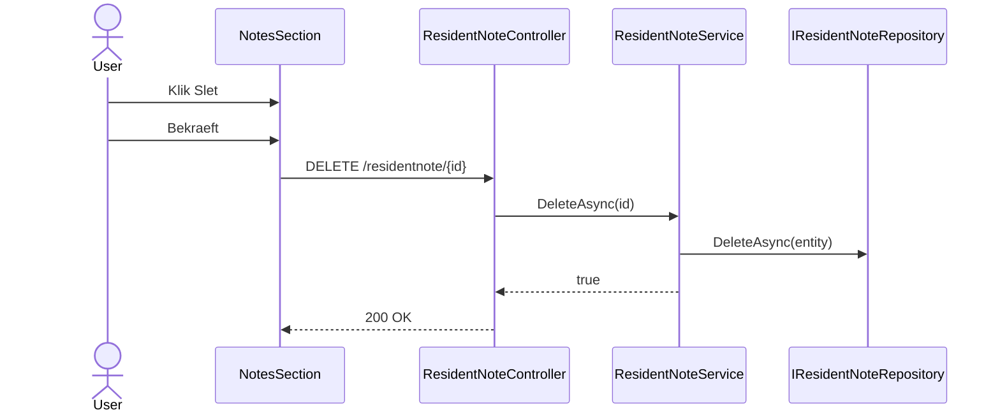

# UC-019 — Sequence Diagram

```mermaid
sequenceDiagram
    actor U as User
    participant UI as NotesSection
    participant Api as ResidentNoteController
    participant Svc as ResidentNoteService
    participant Repo as IResidentNoteRepository

    U->>UI: Klik Slet
    U->>UI: Bekraeft
    UI->>Api: DELETE /residentnote/{id}
    Api->>Svc: DeleteAsync(id)
    Svc->>Repo: DeleteAsync(entity)
    Svc-->>Api: true
    Api-->>UI: 200 OK
```
