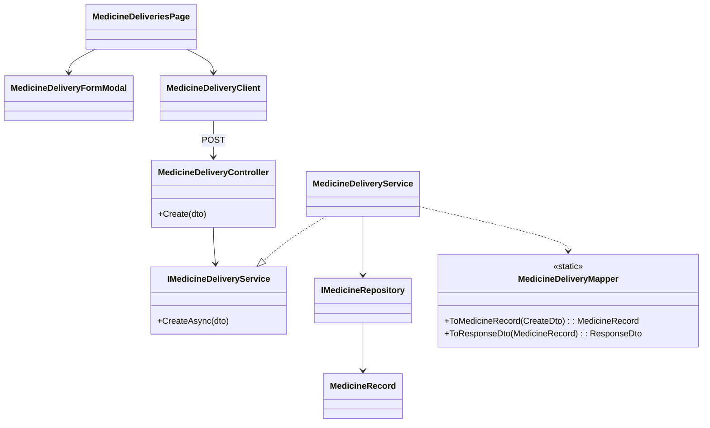

# UC-020 — Design Class Diagram

```mermaid
classDiagram
    class MedicineDeliveriesPage
    class MedicineDeliveryFormModal
    class MedicineDeliveryClient
    class MedicineDeliveryController { +Create(dto) }
    class IMedicineDeliveryService { +CreateAsync(dto) }
    class MedicineDeliveryService
    class IMedicineRepository
    class MedicineDeliveryMapper {
        <<static>>
        +ToMedicineRecord(CreateDto): MedicineRecord
        +ToResponseDto(MedicineRecord): ResponseDto
    }
    class MedicineRecord

    MedicineDeliveriesPage --> MedicineDeliveryFormModal
    MedicineDeliveriesPage --> MedicineDeliveryClient
    MedicineDeliveryClient --> MedicineDeliveryController : POST
    MedicineDeliveryController --> IMedicineDeliveryService
    MedicineDeliveryService ..|> IMedicineDeliveryService
    MedicineDeliveryService --> IMedicineRepository
    MedicineDeliveryService ..> MedicineDeliveryMapper
    IMedicineRepository --> MedicineRecord
```
