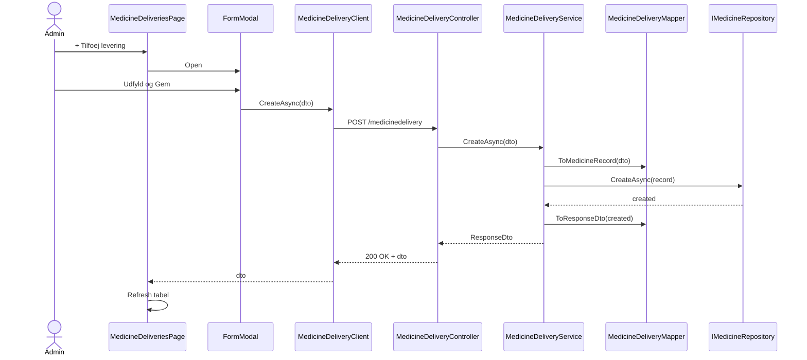

# UC-020 — Sequence Diagram

```mermaid
sequenceDiagram
    actor A as Admin
    participant UI as MedicineDeliveriesPage
    participant Modal as FormModal
    participant Client as MedicineDeliveryClient
    participant Api as MedicineDeliveryController
    participant Svc as MedicineDeliveryService
    participant Map as MedicineDeliveryMapper
    participant Repo as IMedicineRepository

    A->>UI: + Tilfoej levering
    UI->>Modal: Open
    A->>Modal: Udfyld og Gem
    Modal->>Client: CreateAsync(dto)
    Client->>Api: POST /medicinedelivery
    Api->>Svc: CreateAsync(dto)
    Svc->>Map: ToMedicineRecord(dto)
    Svc->>Repo: CreateAsync(record)
    Repo-->>Svc: created
    Svc->>Map: ToResponseDto(created)
    Svc-->>Api: ResponseDto
    Api-->>Client: 200 OK + dto
    Client-->>UI: dto
    UI->>UI: Refresh tabel
```
