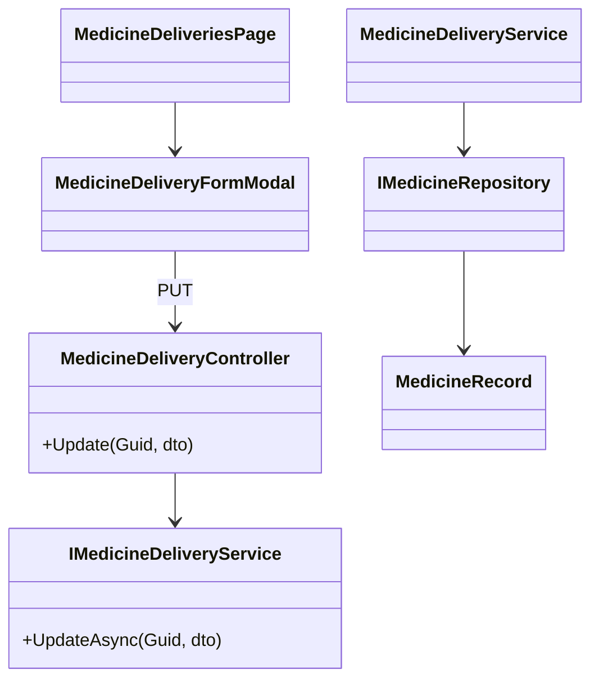

# UC-021 — Design Class Diagram

```mermaid
classDiagram
    class MedicineDeliveriesPage
    class MedicineDeliveryFormModal
    class MedicineDeliveryController { +Update(Guid, dto) }
    class IMedicineDeliveryService { +UpdateAsync(Guid, dto) }
    class MedicineDeliveryService
    class IMedicineRepository
    class MedicineRecord

    MedicineDeliveriesPage --> MedicineDeliveryFormModal
    MedicineDeliveryFormModal --> MedicineDeliveryController : PUT
    MedicineDeliveryController --> IMedicineDeliveryService
    MedicineDeliveryService --> IMedicineRepository
    IMedicineRepository --> MedicineRecord
```
