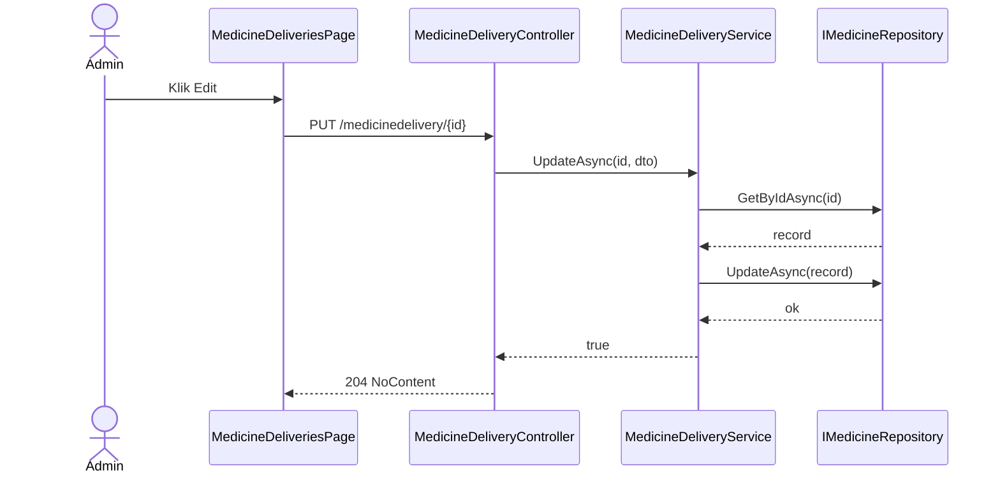

# UC-021 — Sequence Diagram

```mermaid
sequenceDiagram
    actor A as Admin
    participant UI as MedicineDeliveriesPage
    participant Api as MedicineDeliveryController
    participant Svc as MedicineDeliveryService
    participant Repo as IMedicineRepository

    A->>UI: Klik Edit
    UI->>Api: PUT /medicinedelivery/{id}
    Api->>Svc: UpdateAsync(id, dto)
    Svc->>Repo: GetByIdAsync(id)
    Repo-->>Svc: record
    Svc->>Repo: UpdateAsync(record)
    Repo-->>Svc: ok
    Svc-->>Api: true
    Api-->>UI: 204 NoContent
```
