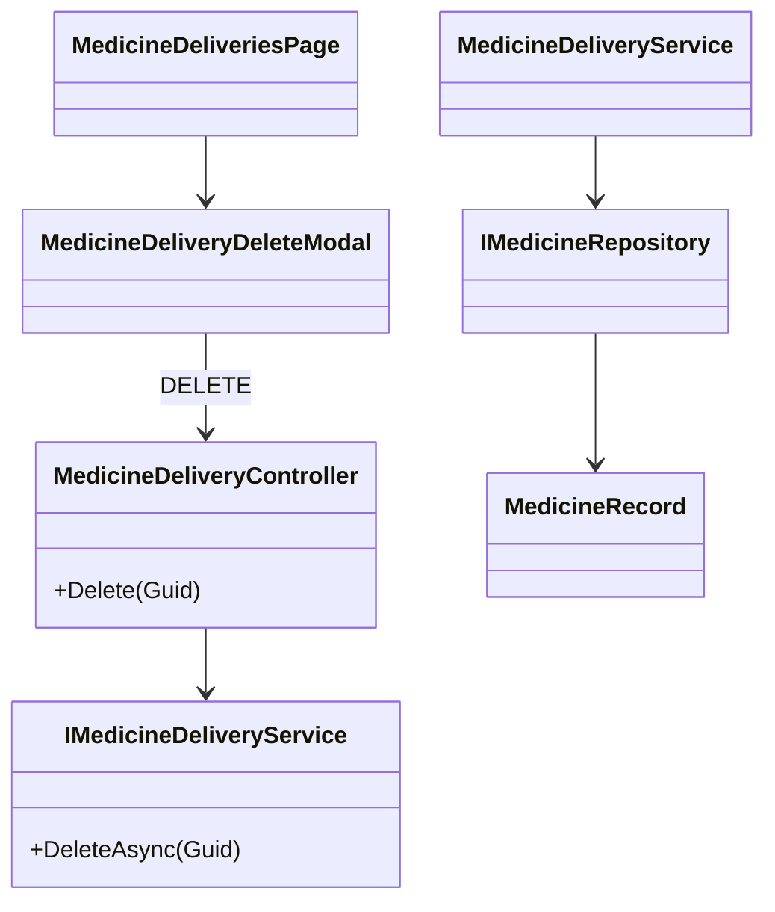

# UC-022 — Design Class Diagram

```mermaid
classDiagram
    class MedicineDeliveriesPage
    class MedicineDeliveryDeleteModal
    class MedicineDeliveryController { +Delete(Guid) }
    class IMedicineDeliveryService { +DeleteAsync(Guid) }
    class MedicineDeliveryService
    class IMedicineRepository
    class MedicineRecord

    MedicineDeliveriesPage --> MedicineDeliveryDeleteModal
    MedicineDeliveryDeleteModal --> MedicineDeliveryController : DELETE
    MedicineDeliveryController --> IMedicineDeliveryService
    MedicineDeliveryService --> IMedicineRepository
    IMedicineRepository --> MedicineRecord
```
