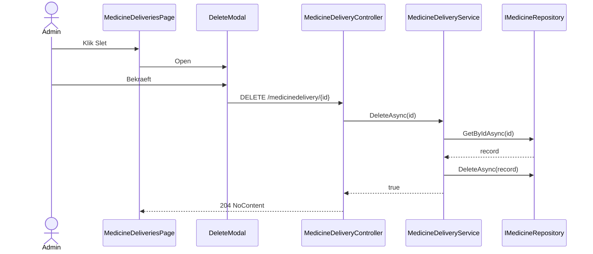

# UC-022 — Sequence Diagram

```mermaid
sequenceDiagram
    actor A as Admin
    participant UI as MedicineDeliveriesPage
    participant Modal as DeleteModal
    participant Api as MedicineDeliveryController
    participant Svc as MedicineDeliveryService
    participant Repo as IMedicineRepository

    A->>UI: Klik Slet
    UI->>Modal: Open
    A->>Modal: Bekraeft
    Modal->>Api: DELETE /medicinedelivery/{id}
    Api->>Svc: DeleteAsync(id)
    Svc->>Repo: GetByIdAsync(id)
    Repo-->>Svc: record
    Svc->>Repo: DeleteAsync(record)
    Svc-->>Api: true
    Api-->>UI: 204 NoContent
```
